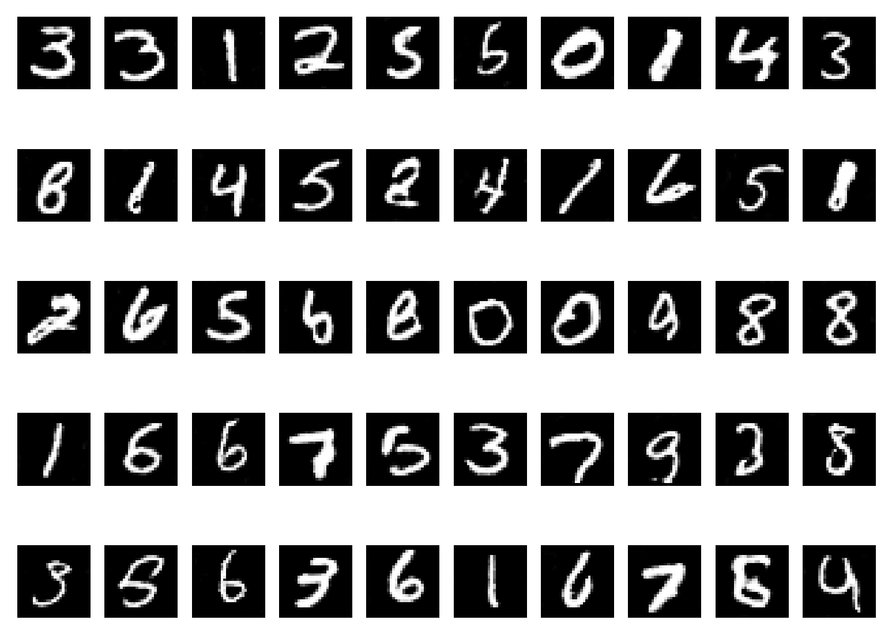

# Deep Convolutional GAN on MNIST

## Introduction

Probably has been done before (most definitely), but I was super bored and thought this was fun lol. I've done this previously using TensorFlow but I wanted to test my "skill" in PyTorch.

## Model

The model was trained using Kaggle's P100 GPU for about 300 epochs. The structure of the model resembles the one in Aurelien Geron's book, *Hands-On Machine Learning with Scikit-Learn, Keras, and TensorFlow*. The generator and discriminator are both CNNs. The generator takes in a 100-dimensional noise vector and outputs a 28x28 image. The discriminator takes in a 28x28 image and outputs a single value, which is the probability that the image is real. Some noise was added to the labels to prevent the discriminator from overpowering the generator.

## Results

The Discriminator can correctly identify about 86% of the images. That being said, the Generator might need further changes as it looked like the digits were written by someone with a bit too much to drink. Might also consider using Lightning to make the code much cleaner.

## References

- [Deep Convolutional GANs by Alec Radford, Luke Metz, Soumith Chintala](https://arxiv.org/abs/1511.06434)
- Hands-on Machine Learning with Scikit-Learn, Keras, and TensorFlow 3rd edition by Aurelien Geron
- Machine Learning with PyTorch and Scikit-Learn by Sebastian Raschka